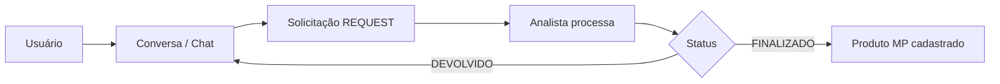

# Controle MP

Sistema de **cadastro e fluxo de matérias-primas (MP)** entre solicitantes e analistas, com chat integrado, solicitações estruturadas, catálogo de produtos e integração opcional com **TOTVS** e **Minha DELPI** (SSO).

## Visão geral

| Componente | Pasta | Stack |
|------------|-------|-------|
| API | `api-cadastro-mp/` | Python 3.12, Flask 3, PostgreSQL, Socket.IO |
| Frontend | `front-cadastro-mp/` | React 19, Vite 7, Axios, Socket.IO client |
| Infra | raiz | Docker Compose (Postgres + API + Front) |

### Domínios de negócio

- **Conversas e mensagens** — canal entre usuários; mensagens podem embutir solicitações de MP
- **Solicitações (Requests)** — pedidos de criar ou alterar MP, com itens e campos tipados
- **Produtos** — cadastro efetivado após finalização da solicitação
- **TOTVS** — consulta de produtos e fornecedores no ERP (somente leitura)
- **Usuários e papéis** — ADMIN, ANALYST, USER
- **Auditoria** — trilha de ações (somente ADMIN)
- **SSO** — login via token Keycloak da Minha DELPI (iframe)

### Fluxo resumido



## Início rápido (Docker)

```bash
cd controle_mp
cp .env.example .env
# Edite .env com senhas e URLs reais

docker compose -f docker-compose.local.yml --env-file .env up --build -d
```

| Serviço | Container | Porta padrão (host) |
|---------|-----------|------------------------|
| PostgreSQL | `controle-mp-db` | `5433` |
| API | `controle-mp-api` | `5000` |
| Frontend | `controle-mp-front` | `8088` |

Na primeira subida, com `RUN_DATABASE_MIGRATIONS_ON_STARTUP=true`, as migrations SQL rodam automaticamente. Com `LOCAL_ADMIN_SEED_ENABLED=true`, um administrador local é criado conforme as variáveis `LOCAL_ADMIN_*`.

**Health checks:**

- API: `GET http://localhost:5000/health`
- Banco: `GET http://localhost:5000/health/db`

## Desenvolvimento sem Docker

### API

```bash
cd api-cadastro-mp
python -m venv .venv && source .venv/bin/activate
pip install -r requirements.txt
# Configure DB_* no .env (host localhost se Postgres local)
python scripts/run_database_migrations.py up
python scripts/ensure_local_admin.py   # se LOCAL_ADMIN_SEED_ENABLED=true
python -m app.main
```

### Frontend

```bash
cd front-cadastro-mp
npm install
```

Crie `.env` (ou use o da raiz do monorepo):

```env
VITE_API_BASE_URL=http://127.0.0.1:5000
VITE_API_PREFIX=/api
VITE_SOCKET_PATH=/socket.io
VITE_DELPI_PARENT_ORIGIN=http://localhost:5173
```

```bash
npm run dev
```

Acesse `http://localhost:5173`. A API precisa aceitar a origem do Vite em `CORS_ORIGINS`.

## Produção

```bash
docker compose -f docker-compose.prod.yml --env-file .env.production up --build -d
```

- Usa `.env.production` (não versionado)
- Frontend escuta apenas em `127.0.0.1:${FRONT_HOST_PORT}` (reverse proxy externo)
- Build do front usa variáveis `VITE_PROD_*`

Consulte [docs/GUIA_DESENVOLVIMENTO.md](docs/GUIA_DESENVOLVIMENTO.md) para deploy, migrations em produção e boas práticas.

## Papéis (RBAC)

| ID | Papel | Permissões principais |
|----|-------|------------------------|
| 1 | ADMIN | Auditoria, gestão de usuários, moderação completa |
| 2 | ANALYST | Processar solicitações, alterar status, flags em produtos |
| 3 | USER | Criar solicitações, conversar, fluxo restrito |

## Documentação

| Documento | Conteúdo |
|-----------|----------|
| [docs/README.md](docs/README.md) | Índice completo da documentação |
| [docs/ARQUITETURA.md](docs/ARQUITETURA.md) | Arquitetura, camadas, integrações |
| [docs/GUIA_DESENVOLVIMENTO.md](docs/GUIA_DESENVOLVIMENTO.md) | Setup, migrations, deploy, troubleshooting |
| [docs/API_REFERENCE.md](docs/API_REFERENCE.md) | Referência de endpoints REST |
| [api-cadastro-mp/README.md](api-cadastro-mp/README.md) | API — estrutura e execução |
| [api-cadastro-mp/docs/](api-cadastro-mp/docs/) | Módulos detalhados (auth, requests, websocket, etc.) |
| [front-cadastro-mp/README.md](front-cadastro-mp/README.md) | Frontend — rotas e execução |
| [front-cadastro-mp/docs/documentacao_do_frontend_controle_mp.md](front-cadastro-mp/docs/documentacao_do_frontend_controle_mp.md) | Frontend — detalhamento técnico |

## Estrutura do repositório

```text
controle_mp/
├── api-cadastro-mp/          # API Flask
│   ├── app/                  # Código (routes, services, repositories)
│   ├── scripts/              # Migrations e seed de admin
│   └── docs/                 # Documentação por módulo
├── front-cadastro-mp/        # SPA React
│   ├── src/
│   └── docs/
├── docker-compose.local.yml
├── docker-compose.prod.yml
├── .env.example
└── docs/                     # Documentação do monorepo
```

## Variáveis de ambiente

Todas as variáveis documentadas estão em [.env.example](.env.example). O arquivo `.env` real **não deve ser commitado** (já está no `.gitignore`).

## Licença e contato

Uso interno DELPI. Para dúvidas sobre integração com Minha DELPI ou TOTVS, alinhar com o time de infraestrutura e ERP.
