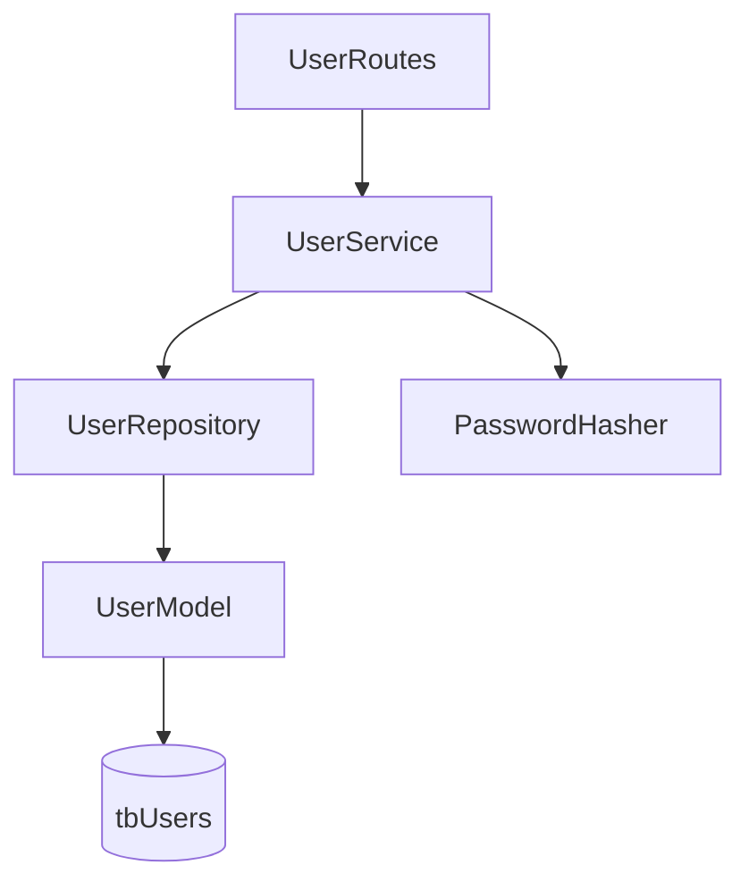

# 📘 Documentação – Módulo de Usuários

Este documento descreve detalhadamente os arquivos responsáveis pelo **módulo de usuários** do projeto **Cadastro MP**, explicando responsabilidades, fluxo de dados e aderência à **Clean Architecture**.

---

## 🧬 `entities/user.py`

### 📌 Responsabilidade
Representa a **entidade de domínio User**. É um objeto imutável (POCO) que modela o usuário dentro do domínio, sem qualquer dependência de infraestrutura ou frameworks.

### 🧠 Características
- Usa `@dataclass(frozen=True)` → imutável
- Não conhece banco, Flask ou SQLAlchemy
- Pode ser usada em testes, regras de negócio ou mapeamentos

### 📄 Campos
- `id`: Identificador único
- `full_name`: Nome completo
- `email`: Email do usuário
- `password`: Senha do usuário
- `role_id`: Papel/perfil
- `created_at`, `updated_at`, `last_login`
- `is_deleted`: Soft delete

---

## 🗄️ `repositories/user_repository.py`

### 📌 Responsabilidade
Camada de **acesso a dados** do usuário. Encapsula todas as queries SQLAlchemy relacionadas à tabela `tbUsers`.

### 🧠 Características
- Herda de `BaseRepository`
- Não contém regras de negócio
- Sempre filtra `is_deleted = FALSE`

### 📄 Métodos
- `get_by_email(email)` – Busca usuário ativo por email
- `get_by_id(user_id)` – Busca usuário ativo por ID
- `list_active(limit, offset)` – Lista usuários ativos com paginação
- `add(model)` – Persiste novo usuário
- `soft_delete(user_id)` – Exclusão lógica

---

## ⚙️ `services/user_service.py`

### 📌 Responsabilidade
Camada de **regras de negócio** relacionadas a usuários. Orquestra validações, segurança e persistência.

### 🧠 Características
- Não conhece HTTP nem Flask
- Depende apenas de `UserRepository`
- Centraliza validações e exceções

### 📄 Métodos
- `create_user(...)`
  - Valida email único
  - Gera hash seguro da senha
- `update_user(...)`
  - Atualiza dados parciais
  - Revalida email
- `delete_user(user_id)`
  - Executa soft delete
- `list_users(limit, offset)`
  - Lista usuários ativos
- `authenticate(email, password)`
  - Valida credenciais
  - Atualiza `last_login`

---

## 🌐 `api/schemas/user_schema.py`

### 📌 Responsabilidade
Define **DTOs (schemas)** de entrada e saída da API usando **Pydantic**.

### 🧠 Características
- Validação automática de payload
- Separação clara entre input e output

### 📄 Schemas
- `CreateUserRequest`
- `UpdateUserRequest`
- `UserResponse`
- `LoginRequest`
- `TokenResponse`

---

## 🌍 `api/routes/user_routes.py`

### 📌 Responsabilidade
Camada HTTP (Flask). Define endpoints REST para usuários.

### 🧠 Características
- Usa `Blueprint`
- Não contém regras de negócio
- Converte HTTP ↔ Service ↔ DTO

### 📄 Endpoints
- `POST /users` – Criar usuário
- `GET /users` – Listar usuários
- `PUT /users/<id>` – Atualizar usuário
- `DELETE /users/<id>` – Remover usuário (soft delete)

### 🔄 Fluxo
```text
Request HTTP → Schema → Service → Repository → Database
```

---

## 🧱 `infrastructure/database/models/user_model.py`

### 📌 Responsabilidade
Mapeamento **ORM (SQLAlchemy)** da tabela `tbUsers`.

### 🧠 Características
- Herda de `BaseModel`
- Define colunas, tipos e constraints
- Representa a estrutura física do banco

### 📄 Destaques
- Índice único em `email`
- FK para `tbRoles`
- Soft delete (`is_deleted`)

---

## 📐 Diagrama de Relacionamento



---

## ✅ Checklist de Qualidade

- ✔️ Clean Architecture respeitada
- ✔️ Regras de negócio isoladas
- ✔️ Soft delete consistente
- ✔️ Validação forte de entrada
- ✔️ Segurança de senha aplicada
- ✔️ Código testável e escalável

---

📌 **Observação Final**
Este módulo serve como **referência padrão** para implementação de outros domínios do sistema (Roles, Conversations, Requests, Products).

