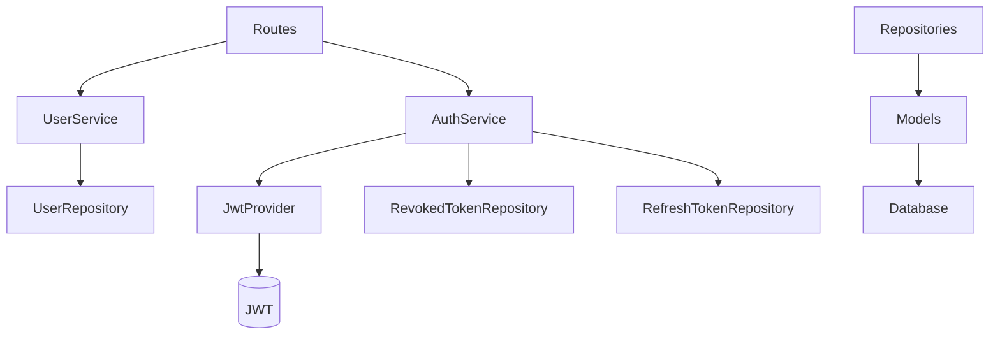

# 👤 Módulo de Usuário Completo – Documentação Unificada

Projeto: **Cadastro MP**  
Backend: **Flask + SQLAlchemy + JWT**  
Arquitetura: **Clean Architecture**

Este documento consolida **todos os módulos relacionados ao Usuário** em um **único módulo lógico**, incluindo:

- Cadastro e gerenciamento de usuários
- Autenticação (login)
- Autorização (JWT)
- Logout real (revogação)
- Refresh Token (sessão)
- RBAC (roles/perfis)
- Auditoria de autenticação
- Rotas protegidas
- Testes

O objetivo é tratar o **Usuário como um módulo completo de identidade e acesso**.

---

## 🧱 Visão Geral do Módulo de Usuário

```text
HTTP
 ├── /users        → gerenciamento de usuários
 ├── /auth/login   → autenticação
 ├── /auth/refresh → renovação de sessão
 ├── /auth/logout  → logout real
 └── /test/*       → validação de segurança
```

```text
Routes → Services → Repositories → Models → Database
            ↓
         Security (JWT)
```

---

# 1️⃣ Domínio de Usuário

## 🧬 Entidade – `User`

Arquivo: `app/entities/user.py`

Representa o **usuário no domínio**:
- Imutável
- Independente de frameworks
- Fonte de verdade conceitual

Campos principais:
- `id`
- `full_name`
- `email`
- `role_id`
- `created_at`, `updated_at`, `last_login`
- `is_deleted`

---

# 2️⃣ Persistência – Usuários

## 🧱 Model – `UserModel`

Arquivo: `app/infrastructure/database/models/user_model.py`

Mapeamento ORM da tabela `tbUsers`.

Características:
- Email único
- Soft delete
- FK para roles

---

## 🗄️ Repository – `UserRepository`

Arquivo: `app/repositories/user_repository.py`

Responsável por:
- Buscar usuário por email
- Buscar por ID
- Listar usuários ativos
- Persistir novos usuários
- Soft delete

---

## ⚙️ Service – `UserService`

Arquivo: `app/services/user_service.py`

Centraliza regras de negócio do usuário:
- Criação
- Atualização
- Exclusão lógica
- Listagem
- **Autenticação de credenciais**

> Importante: autenticação valida senha, **não emite tokens**.

---

# 3️⃣ Autenticação (JWT)

## 🔏 JwtProvider

Arquivo: `app/infrastructure/security/jwt_provider.py`

Responsável por:
- Emissão de access token
- Emissão de refresh token
- Validação de tokens

Claims padrão:
- `iss`, `aud`
- `sub` (user_id)
- `iat`, `exp`
- `jti`
- `typ` (`access` | `refresh`)

---

# 4️⃣ Sessão e Tokens

## 🔄 Refresh Token

Tabela: `tbRefreshTokens`

Finalidade:
- Manter sessão do usuário
- Permitir renovação sem novo login
- Implementar rotação de tokens

Service: `RefreshTokenService`

---

## ⛔ Logout Real

Tabela: `tbRevokedTokens`

Finalidade:
- Revogar access tokens
- Tornar JWT stateful no backend

Service: `AuthService`

---

# 5️⃣ Autorização

## 🧱 Middleware – `require_auth`

Arquivo: `app/api/middlewares/auth_middleware.py`

Responsável por:
- Extrair Bearer token
- Validar JWT
- Bloquear tokens revogados
- Popular `g.auth`

---

## 🧩 RBAC – Roles

Decorator:
```python
@require_roles(1)
```

Funcionamento:
- Usa `role_id` do JWT
- Retorna 403 se não autorizado

---

# 6️⃣ Auditoria de Usuário

Tabela: `audit_log`

Eventos registrados:
- LOGIN_SUCCESS
- LOGIN_FAILED
- REFRESH_SUCCESS
- LOGOUT

Service: `AuditService`

Finalidade:
- Rastreabilidade
- Segurança
- Diagnóstico

---

# 7️⃣ API – Rotas do Usuário

## 👤 `/users`

- `POST /users`
- `GET /users`
- `PUT /users/<id>`
- `DELETE /users/<id>`

Responsável apenas por HTTP (sem regra de negócio).

---

## 🔐 `/auth`

- `POST /auth/login`
- `POST /auth/refresh`
- `POST /auth/logout`

Integra autenticação, refresh e logout real.

---

# 8️⃣ Rotas Protegidas de Teste

Arquivo: `app/api/routes/test_routes.py`

- `GET /test/protected`
- `GET /test/admin-only`

Usadas para validar:
- JWT
- Middleware
- RBAC

---

# 9️⃣ Testes Automatizados

Ferramenta: **pytest**

Cobertura mínima:
- Login
- Refresh
- Logout
- Token revogado
- RBAC

Benefícios:
- Evita regressões
- Garante segurança

---

# 🔗 Diagrama Geral do Módulo



---

# ✅ Checklist do Módulo de Usuário Completo

- ✔️ Cadastro e gestão de usuários
- ✔️ Login seguro
- ✔️ JWT access token
- ✔️ Refresh token
- ✔️ Logout real
- ✔️ Middleware de autenticação
- ✔️ RBAC
- ✔️ Auditoria
- ✔️ Testes

---

# 🚀 Conclusão

O **Módulo de Usuário** agora é um **módulo de identidade completo**, no padrão de aplicações corporativas modernas, pronto para:

- Crescimento
- Integração com frontend
- Controle de acesso avançado
- Auditoria e compliance

Este documento representa a **visão oficial do módulo de Usuário do projeto Cadastro MP**.

