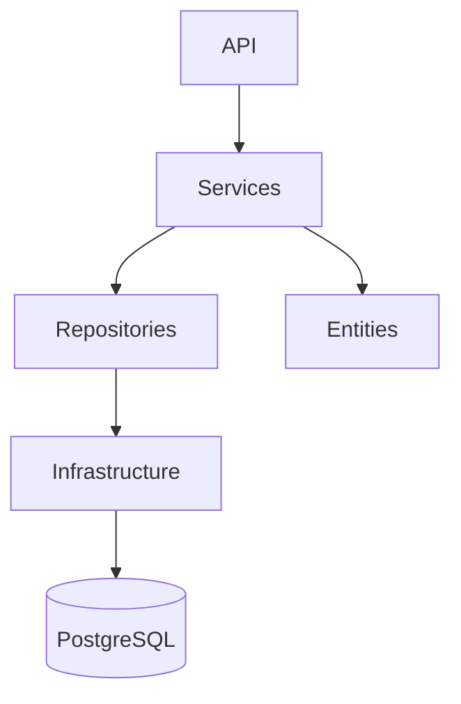

# Estrutura de Pastas – Projeto Cadastro MP

Este documento define a **estrutura oficial de pastas** do projeto **Cadastro MP**, seguindo **Clean Architecture**, **SOLID** e boas práticas para **Flask + PostgreSQL**.

---

## 📁 Estrutura Geral

```text
app-cadastro-mp
│
├── api-cadastro-mp
│   ├── app
│   │   ├── core
│   │   ├── entities
│   │   ├── repositories
│   │   ├── services
│   │   ├── infrastructure
│   │   ├── api
│   │   ├── config
│   │   └── main.py
│   │
│   ├── tests
│   │
│   ├── venv
│   ├── .env
│   ├── requirements.txt
│   └── README.md
│
└── front-cadastro-mp
    ├── src
    ├── public
    ├── index.html
    ├── package.json
    └── vite.config.js
```

---

## 🧠 API – Detalhamento por Camada

### 📦 `core/`
Camada de **abstrações e regras transversais**.

```text
core
├── base_repository.py
├── base_service.py
├── exceptions.py
├── enums.py
└── interfaces
    ├── repository_interface.py
    └── service_interface.py
```

**Responsabilidades:**
- Contratos (interfaces)
- Exceções de domínio
- Classes base reutilizáveis

---

### 🧬 `entities/`
Entidades de domínio (**POCOs**).

```text
entities
├── user.py
├── role.py
├── conversation.py
├── message.py
├── message_file.py
├── product.py
├── product_field.py
├── request.py
└── audit_log.py
```

**Regras:**
- Sem Flask
- Sem SQL
- Apenas dados e validações simples

---

### 🗄️ `repositories/`
Acesso a dados e persistência.

```text
repositories
├── user_repository.py
├── role_repository.py
├── conversation_repository.py
├── message_repository.py
├── product_repository.py
├── request_repository.py
└── audit_log_repository.py
```

**Regras:**
- Apenas CRUD e queries
- Nenhuma regra de negócio
- Dependem de `infrastructure/database`

---

### ⚙️ `services/`
Regras de negócio e orquestração.

```text
services
├── auth_service.py
├── user_service.py
├── conversation_service.py
├── message_service.py
├── product_service.py
├── request_service.py
└── audit_service.py
```

**Regras:**
- Chamam Repositories
- Aplicam validações e regras
- Não conhecem HTTP

---

### 🧱 `infrastructure/`
Implementações técnicas.

```text
infrastructure
├── database
│   ├── connection.py
│   ├── session.py
│   └── base_model.py
│
├── security
│   ├── password_hasher.py
│   └── jwt_provider.py
│
├── logging
│   └── audit_logger.py
│
└── storage
    └── file_storage.py
```

---

### 🌐 `api/`
Camada HTTP (Flask).

```text
api
├── routes
│   ├── auth_routes.py
│   ├── user_routes.py
│   ├── conversation_routes.py
│   ├── message_routes.py
│   ├── product_routes.py
│   └── request_routes.py
│
├── middlewares
│   ├── auth_middleware.py
│   └── error_handler.py
│
└── schemas
    ├── user_schema.py
    ├── message_schema.py
    └── product_schema.py
```

**Regras:**
- Recebe requisições HTTP
- Chama Services
- Retorna DTOs/JSON

---

### ⚙️ `config/`
Configurações da aplicação.

```text
config
├── settings.py
├── database.py
└── flask_config.py
```

---

### ▶️ `main.py`
Ponto de entrada da aplicação.

```python
from flask import Flask
from config.flask_config import configure_app
from api.routes import register_routes

def create_app() -> Flask:
    app = Flask(__name__)
    configure_app(app)
    register_routes(app)
    return app

app = create_app()

if __name__ == "__main__":
    app.run()
```

---

## 🧪 Testes

```text
tests
├── unit
│   ├── services
│   └── repositories
└── integration
```

---

## 📐 Diagrama de Arquitetura



---

## ✅ Checklist de Qualidade

- Arquitetura em camadas preservada
- Clean Code aplicado
- SOLID respeitado
- Testabilidade garantida
- Escalável e manutenível

